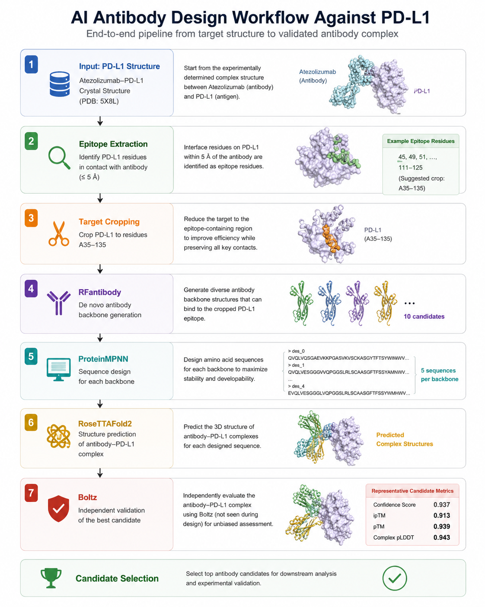
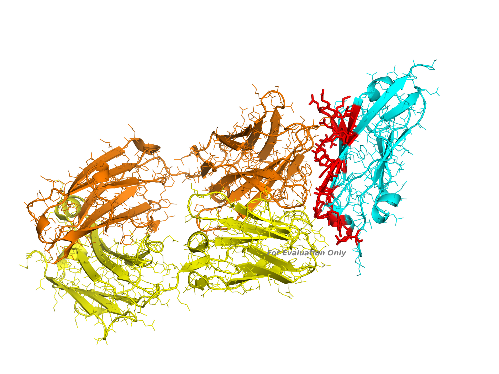
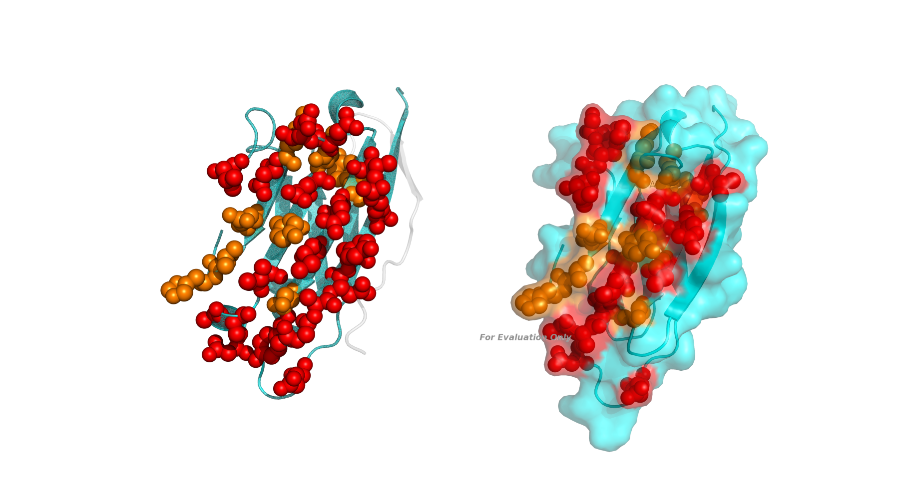
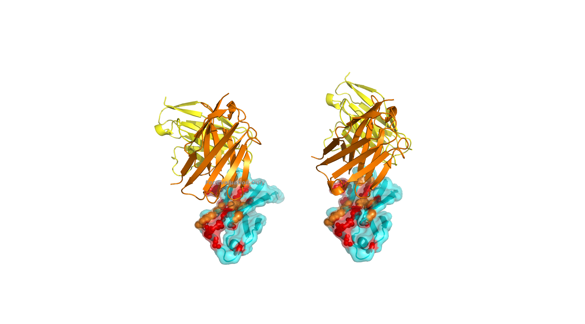
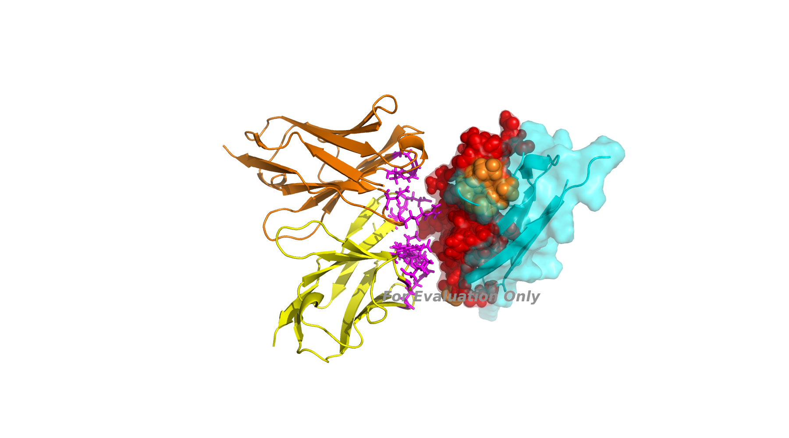
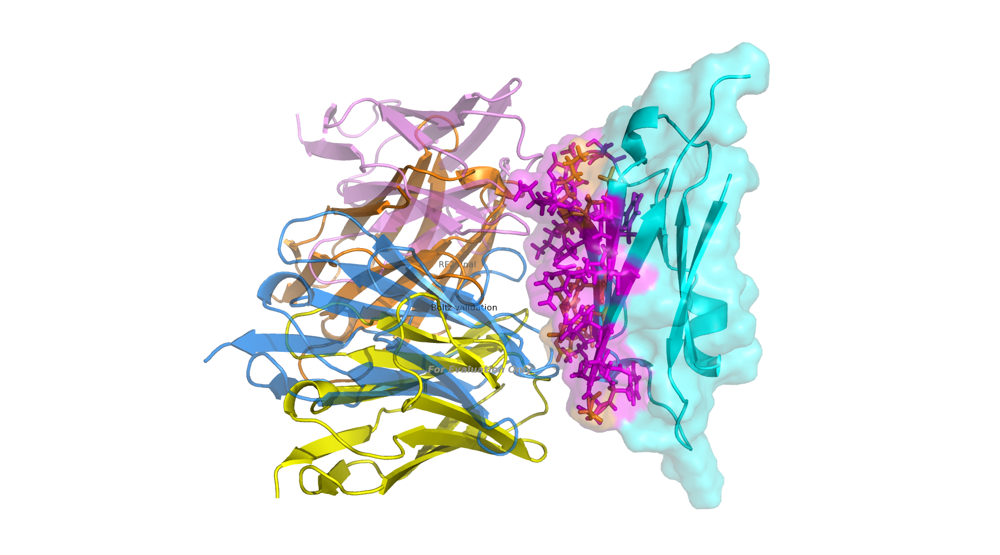
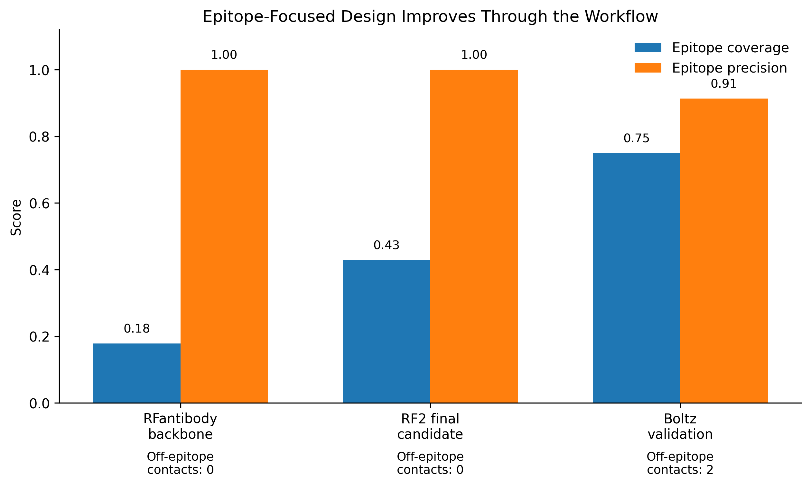

# AI-Guided Epitope-Focused Antibody Design Against PD-L1

An end-to-end computational antibody design workflow integrating **RFantibody**, **ProteinMPNN**, **RoseTTAFold2 (RF2)**, **Boltz**, and a custom epitope-aware structural scoring pipeline.

This project demonstrates how multiple AI-based protein design and structure prediction tools can be combined into a reproducible antibody discovery workflow. The goal was not simply to generate arbitrary PD-L1-binding antibody models, but to design and prioritize antibody candidates that engage a clinically relevant PD-L1 epitope defined from the atezolizumab–PD-L1 complex structure.

---

## Project Overview

**Target:** Human PD-L1  
**Reference complex:** Atezolizumab–PD-L1, PDB: `5X8L`  
**Design objective:** Generate de novo antibody candidates targeting an atezolizumab-like PD-L1 epitope  
**Final selected candidate:** `pdl1_fv_hotspot_set1_1_dldesign_3_best.pdb`

This workflow uses a known therapeutic antibody complex as a structural guide. PD-L1 residues contacted by atezolizumab were extracted from the reference structure and used to guide RFantibody design through hotspot-based targeting. Candidate designs were then refined and evaluated using ProteinMPNN, RF2, Boltz, and custom structural scoring.

---

## Workflow

<p align="center">
  
</p>

<p align="center">
<b>Figure 1.</b> Epitope-focused AI antibody design workflow against PD-L1.
    The pipeline starts from the PD-L1–atezolizumab reference complex (PDB: 5X8L),
    extracts the atezolizumab-like epitope, crops PD-L1 to residues 35–135 (in chain A),
    generates hotspot-guided RFantibody backbones, designs sequences with ProteinMPNN,
    predicts complexes with RF2, ranks candidates using custom epitope-aware scoring,
    and validates the final candidate with Boltz.
</p>

---

## Methods

### 1. Reference Epitope Extraction

The experimentally determined atezolizumab–PD-L1 complex structure (`5X8L`) was used to define the target epitope. PD-L1 residues within **5 Å** of atezolizumab were identified as reference epitope residues. The epitope extraction script (`01_extract_pdl1_epitope.py`) identifies PD-L1 residues within 5 Å of atezolizumab chains F and K and prints the resulting residue list to the terminal. Based on this epitope-containing region, PD-L1 was cropped to residues 35–135 (in chain A) using `02_crop_pdl1_target.py`, which generated the cropped antigen input file `pdl1_A35_135.pdb`.

This reference epitope served two purposes:

1. To define hotspot residues for RFantibody design.
2. To provide a quantitative benchmark for scoring designed antibody candidates.

<p align="center">
  
</p>

<p align="center">
<b>Figure 2.</b> Identification of PD-L1 epitope residues from the atezolizumab–PD-L1 complex. Reference epitope residues are shown on the PD-L1 surface and were used to guide hotspot-based antibody design.
</p>

---

### 2. PD-L1 Target Cropping

To reduce computational cost while preserving the relevant antibody-binding interface, the PD-L1 target was cropped to residues:

```text
PD-L1 chain A: residues 35–135
```

This cropped target retained the atezolizumab-contacting epitope and neighboring structural context required for antibody docking and interface evaluation. The same cropped antigen was used in the subsequent hotspot-guided RFantibody design step.

<p align="center">
  
</p>

<p align="center">
  <b>Figure 3.</b> PD-L1 target cropping strategy. The PD-L1 chain from the
  atezolizumab–PD-L1 reference complex was cropped to residues 35–135 (in chain A) while
  preserving the reference epitope. Epitope residues are shown in red, and hotspot
  residues used for hotspot-guided RFantibody design are shown in orange.
</p>

---

### 3. Initial RFantibody Design and Problem Identification

An initial RFantibody run generated antibody-like candidates against the cropped PD-L1 target. However, because the initial run did not explicitly constrain the design toward the atezolizumab epitope, many candidates showed limited overlap with the desired epitope.

This motivated a second, epitope-guided design round using hotspot residues derived from the reference atezolizumab–PD-L1 interface.

---

### 4. Hotspot-Guided RFantibody Backbone Generation

Hotspot residues were selected from the atezolizumab-like PD-L1 epitope and used to guide RFantibody backbone generation.

```text
Hotspot residues:
A56, A59, A62, A66, A68, A69, A112, A117
```

RFantibody was run using the cropped PD-L1 target and the `hu-4D5-8_Fv` framework.

**Output**

```text
5 hotspot-guided RFantibody Fv backbone candidates
```

Backbone candidates were scored for epitope engagement, and the top two backbones were selected for sequence design.

<p align="center">
  
</p>

<p align="center">
  <b>Figure 4.</b> Hotspot-guided RFantibody backbone candidates targeting the PD-L1 epitope. 
  Two top RFantibody backbone candidates are shown after hotspot-guided design against the cropped 
  PD-L1 antigen. PD-L1 is shown in cyan, antibody heavy chains in orange, and light chains in yellow. Reference epitope residues are shown in red, and hotspot residues used to guide RFantibody design 
  are highlighted in orange.
</p>

---

### 5. ProteinMPNN Sequence Design

ProteinMPNN was applied to the top RFantibody backbone candidates to design antibody loop sequences while preserving the RFantibody-generated binding geometry.

**Input**

```text
Top 2 RFantibody backbone candidates
```

**Output**

```text
5 ProteinMPNN sequence designs per backbone
10 total sequence-designed antibody candidates
```

Because ProteinMPNN primarily modifies sequence while preserving backbone geometry, candidates derived from the same backbone retained similar geometric epitope contact profiles before RF2 refinement.

---

### 6. RF2 Complex Structure Prediction

The 10 ProteinMPNN-designed antibody candidates were folded and refined as antibody–PD-L1 complexes using RF2.

A key technical issue encountered during this step was an environment mismatch between RFantibody-compatible `SE3Transformer` and the `SE3Transformer` installed under the RFdiffusion environment. Using the incorrect SE3Transformer implementation produced invalid RF2 coordinates. This was resolved by explicitly prioritizing the RFantibody-compatible SE3Transformer in `PYTHONPATH`:

```bash
export PYTHONPATH=/workspace/RFantibody/include/SE3Transformer:/workspace/RFantibody/src:$PYTHONPATH
```

The final RF2 run used:

```text
inference.num_recycles = 5
inference.cautious = True
inference.hotspot_show_proportion = 0.1
model.model_weights = /workspace/RFantibody/weights/RF2_ab.pt
```

---

### 7. Custom Epitope-Aware Scoring

A custom Python scoring script was used to compare each predicted antibody–PD-L1 complex against the atezolizumab reference epitope.

The scoring evaluated:

| Metric | Description |
|---|---|
| Epitope coverage | Fraction of reference epitope residues contacted by the designed antibody |
| Epitope precision | Fraction of designed antibody contacts that fall within the reference epitope |
| Covered epitope count | Number of reference epitope residues contacted by the designed antibody |
| Off-epitope contact count | Number of contacts outside the reference epitope |
| Target CA RMSD | Alignment quality of the designed PD-L1 target relative to the reference PD-L1 structure |
| Combined score | Aggregate score balancing coverage, precision, and off-epitope contacts |

---

### 8. Independent Validation with Boltz

The final selected antibody sequence was submitted to Boltz as an orthogonal structure prediction check. The final selected antibody sequence was submitted to Boltz as an orthogonal structure prediction check.

The final RF2 candidate sequence was extracted using `04_extract_candidate_sequences.py`, which prints the PD-L1 target chain, antibody heavy chain, and antibody light chain sequences from the selected RF2-predicted complex. These sequences were then used to prepare the Boltz input YAML file, `final_candidate_boltz.yaml`, for independent structural validation.

Boltz was not used for RFantibody backbone generation, ProteinMPNN sequence design, or RF2 refinement. Therefore, Boltz served as an independent validation step to assess whether the final antibody sequence could recover an epitope-focused PD-L1-binding pose.

---

## Results

### Pipeline Summary

| Step | Output |
|---|---|
| Reference epitope extraction | Atezolizumab-contacting PD-L1 epitope from `5X8L` |
| Target preparation | Cropped PD-L1 target, residues A35–A135 |
| Hotspot-guided RFantibody | 5 antibody Fv backbone candidates |
| Backbone selection | Top 2 epitope-focused backbones |
| ProteinMPNN | 10 sequence-designed candidates |
| RF2 | 10 predicted antibody–PD-L1 complex structures |
| Custom scoring | Final candidate selected by epitope coverage, precision, and off-epitope contacts |
| Boltz | Independent structural validation of the final candidate |

---

### RFantibody Backbone Scoring

The top hotspot-guided RFantibody backbones showed clean epitope-focused binding geometry before sequence redesign.

| Candidate | Epitope Coverage | Epitope Precision | Covered Epitope Residues | Off-Epitope Contacts | Target CA RMSD |
|---|---:|---:|---:|---:|---:|
| `pdl1_fv_hotspot_set1_1.pdb` | 0.1786 | 1.0000 | 5 | 0 | 0.111 |
| `pdl1_fv_hotspot_set1_4.pdb` | 0.1786 | 1.0000 | 5 | 0 | 0.115 |

These two backbones were selected for ProteinMPNN sequence design.

---

### RF2-Refined Candidate Ranking

After ProteinMPNN sequence design and RF2 complex prediction, the top RF2-refined candidate was:

```text
pdl1_fv_hotspot_set1_1_dldesign_3_best.pdb
```

| Candidate | Combined Score | Epitope Coverage | Epitope Precision | Covered Epitope Residues | Off-Epitope Contacts | Target CA RMSD |
|---|---:|---:|---:|---:|---:|---:|
| `pdl1_fv_hotspot_set1_1_dldesign_3_best.pdb` | 0.6000 | 0.4286 | 1.0000 | 12 | 0 | 0.366 |
| `pdl1_fv_hotspot_set1_1_dldesign_2_best.pdb` | 0.6036 | 0.4643 | 0.9286 | 13 | 1 | 0.426 |
| `pdl1_fv_hotspot_set1_1_dldesign_0_best.pdb` | 0.5000 | 0.2857 | 1.0000 | 8 | 0 | 0.392 |

Although `dldesign_2` had a slightly higher combined score, `dldesign_3` was selected as the final candidate because it maintained **perfect epitope precision** and **zero off-epitope contacts** while covering 12 of 28 reference epitope residues.

---

### Final Candidate

```text
Final RF2 candidate:
pdl1_fv_hotspot_set1_1_dldesign_3_best.pdb
```

| Metric | Value |
|---|---:|
| Reference epitope residues | 28 |
| Covered epitope residues | 12 |
| Epitope coverage | 0.4286 |
| Epitope precision | 1.0000 |
| Off-epitope contacts | 0 |
| Target CA RMSD | 0.366 Å |

This candidate represents a clean epitope-focused antibody design: it engages a substantial fraction of the atezolizumab-like PD-L1 epitope while avoiding off-epitope contacts in the RF2-predicted complex.

<p align="center">
  
</p>

<p align="center">
  <b>Figure 5.</b> Final RF2-predicted antibody–PD-L1 complex selected from the
  hotspot-guided RFantibody and ProteinMPNN workflow. PD-L1 is shown in cyan,
  the designed antibody heavy chain in orange, and the light chain in yellow.
  Reference epitope residues are shown in red, and hotspot residues used for
  RFantibody design are highlighted in orange. The final candidate
  <code>pdl1_fv_hotspot_set1_1_dldesign_3_best.pdb</code> covered 12 of 28
  reference epitope residues with epitope precision of 1.0 and zero off-epitope
  contacts.
</p>

---

### Boltz Independent Validation

Boltz independently predicted a PD-L1-binding pose for the final antibody sequence.

```text
Boltz validation model:
final_candidate_boltz_model_0.pdb
```

| Metric | Value |
|---|---:|
| Combined score | 0.7989 |
| Epitope coverage | 0.7500 |
| Epitope precision | 0.9130 |
| Covered epitope residues | 21 |
| Off-epitope contacts | 2 |
| Target CA RMSD | 1.264 Å |

<p align="center">  </p> <p align="center"> <b>Figure 6.</b> Comparison of RF2 and Boltz antibody binding modes after PD-L1 alignment. The PD-L1 target chains from the RF2 and Boltz models were aligned using Cα atoms, and the antibody poses were overlaid to compare predicted binding modes. PD-L1 is shown in cyan, the RF2 antibody in orange/yellow, and the Boltz antibody in marine/violet. The overlay shows that Boltz independently recovered an epitope-focused binding mode near the RF2-selected design pose. </p>

<p align="center">
  
</p>


<p align="center">
  <b>Figure 7.</b> Quantitative summary of epitope-focused antibody design performance across the workflow.
  RFantibody backbone generation produced clean epitope-focused candidates with perfect precision but limited coverage.
  RF2 refinement improved epitope coverage while maintaining epitope precision of 1.0 and zero off-epitope contacts.
  Boltz validation further supported an epitope-focused binding mode, with higher epitope coverage and modest off-epitope contact.
</p>

Boltz predicted that the final antibody sequence retained an epitope-focused binding mode on PD-L1, covering **21 of 28** atezolizumab-contacting epitope residues with **0.91 epitope precision**.

This orthogonal validation supports the interpretation that the final designed antibody sequence is biased toward the intended PD-L1 epitope rather than an unrelated surface patch.

---

## Key Takeaways

- A known therapeutic antibody complex can be used to define a clinically relevant target epitope for computational antibody design.
- Unguided antibody generation may not sufficiently target the intended epitope, motivating hotspot-guided design.
- RFantibody can generate antibody-like Fv backbones against a cropped antigen target.
- ProteinMPNN can redesign antibody loop sequences while preserving backbone geometry.
- RF2 can refine antibody–antigen complex structures, but environment compatibility is critical.
- Boltz can provide an independent structural validation step.
- Custom epitope-aware scoring is essential for distinguishing epitope-focused candidates from generic surface binders.

---

## Repository Structure

```text
data/
├── input/
│   ├── 5X8L.pdb
│   └── pdl1_A35_135.pdb
└── output/

scripts/
├── extract_pdl1_epitope.py
├── crop_pdl1_target.py
├── score_epitope_contacts.py
└── extract_candidate_sequences.py

results/
├── rfantibody/
│   └── hotspot_backbones/
├── proteinmpnn/
│   └── sequence_designs/
├── rf2/
│   ├── predictions/
│   └── epitope_scores_fv_hotspot_rf2_fixed.csv
├── boltz/
│   ├── final_candidate_boltz.yaml
│   ├── final_candidate_boltz_model_0.pdb
│   └── epitope_scores_boltz.csv
└── final_candidate/
    ├── pdl1_fv_hotspot_set1_1_dldesign_3_best.pdb
    └── final_candidate_boltz_model_0.pdb

figures/
├── workflow.png
├── epitope_extraction.png
└── RFantibody_Design.png
```

---

## Reproducibility Notes

The RF2 step requires the RFantibody-compatible SE3Transformer implementation to be prioritized in `PYTHONPATH`:

```bash
export PYTHONPATH=/workspace/RFantibody/include/SE3Transformer:/workspace/RFantibody/src:$PYTHONPATH
```

If the incorrect SE3Transformer package is imported, RF2 may either fail with:

```text
AttributeError: 'ConvSE3' object has no attribute 'weights'
```

or produce invalid coordinates with extremely large coordinate values. RF2 outputs should therefore be checked for coordinate sanity before scoring.

---

## Limitations

This project is a computational antibody design workflow only. The designed antibody candidates have **not** been experimentally validated.

The results should be interpreted as computational prioritization, not experimental evidence of binding.

Future work includes:

- Interface energy analysis
- Clash and developability assessment
- Binding affinity prediction
- Molecular dynamics simulations
- In vitro expression and purification
- Experimental PD-L1 binding validation
- Competition assay against atezolizumab
- Affinity maturation

---

## References

- RFantibody
- ProteinMPNN
- RoseTTAFold2 / RF2
- Boltz
- Atezolizumab–PD-L1 complex structure, PDB: `5X8L`
