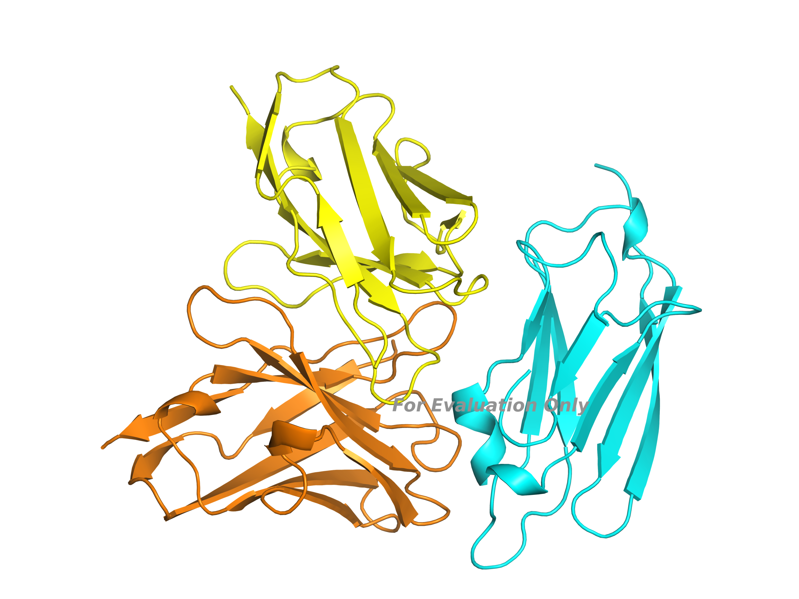

# AI-Guided De Novo Antibody Design Against PD-L1

An end-to-end computational antibody design workflow integrating **RFantibody**, **ProteinMPNN**, **RoseTTAFold2 (RF2)**, and **Boltz**.

This project demonstrates how multiple open-source AI models can be combined into a reproducible antibody discovery workflow, starting from an experimentally determined antigen–antibody complex and ending with independent structural validation.

---

# Project Overview

Unlike conventional tutorials that simply reproduce published examples, this project applies RFantibody to a new therapeutic target.

**Target:** Human PD-L1

**Reference Complex:** Atezolizumab–PD-L1 (PDB: 5X8L)

**Objective:** Generate de novo antibody candidates targeting the PD-L1 epitope using an AI-guided computational workflow.

---

# Workflow

<p align="center">
  
</p>

<p align="center">
<b>Figure 1.</b> End-to-end computational workflow for de novo antibody design against PD-L1. The pipeline begins with epitope extraction from the experimentally determined PD-L1–Atezolizumab complex (PDB: 5X8L), followed by target cropping, RFantibody backbone generation, ProteinMPNN sequence design, RoseTTAFold2 structure prediction, and independent structural validation using Boltz.
</p>

---

# Methods

## 1. Epitope Extraction

To focus antibody design on the experimentally validated binding site, interface residues between PD-L1 and Atezolizumab were identified from the crystal structure (PDB: 5X8L). Residues within **5 Å** of the antibody were extracted, and the target was subsequently cropped to residues **A35–A135**.

<p align="center">
  
</p>

<p align="center">
<b>Figure 2.</b> Identification of PD-L1 epitope residues from the experimentally determined PD-L1–Atezolizumab complex. Interface residues (red) were extracted to define the cropped PD-L1 target (A35–A135).
</p>

---

## 2. Target Cropping

The extracted PD-L1 epitope was expanded to include neighboring residues, generating a cropped target spanning residues **A35–A135**.

Cropping substantially reduces computational cost while preserving the complete antibody-binding interface.

---

## 3. RFantibody Backbone Generation

The cropped PD-L1 structure was used as the design target for RFantibody. Multiple de novo antibody backbone candidates were generated against the selected epitope.

<p align="center">
  
</p>

<p align="center">
<b>Figure 3.</b> Representative RFantibody-generated antibody backbone docked against the cropped PD-L1 target. PD-L1 is shown in cyan, while the designed antibody heavy and light chains are shown in orange and yellow, respectively.
</p>

---

## 4. ProteinMPNN Sequence Design

ProteinMPNN optimized amino acid sequences for each generated antibody backbone while preserving structural compatibility.

**Output**

- Five sequence designs were generated for each RFantibody backbone candidate.

---

## 5. RoseTTAFold2 Structure Prediction

The ProteinMPNN-designed antibody sequences were folded using RoseTTAFold2 to predict the complete antibody–PD-L1 complex structures.

**Output**

- Predicted structures for all designed antibody candidates.

---

## 6. Independent Validation with Boltz

Boltz independently evaluated the predicted antibody–PD-L1 complexes.

Unlike RF2, Boltz was not involved in backbone generation or sequence optimization, providing an independent assessment of structural confidence.

---

# Results

## Pipeline Summary

| Step | Output |
|------|--------|
| RFantibody | 10 de novo antibody backbones |
| ProteinMPNN | 5 sequences per backbone |
| RoseTTAFold2 | Predicted antibody–PD-L1 complex structures |
| Boltz | Independent structural validation |

---

## Representative Candidate

**Candidate**

```
pdl1_ab_des_0_dldesign_0
```

### Boltz Validation

| Metric | Value |
|--------|------:|
| Confidence Score | **0.937** |
| ipTM | **0.913** |
| pTM | **0.939** |
| Complex pLDDT | **0.943** |

These metrics indicate a highly confident predicted antibody–PD-L1 complex.

---

# Repository Structure

```text
data/
├── input/
└── output/

scripts/
├── extract_pdl1_epitope.py
├── crop_pdl1_target.py
└── extract_candidate_sequences.py

results/
├── rfantibody/
├── proteinmpnn/
├── rf2/
└── boltz/
```

---

# Limitations

This project demonstrates a computational antibody design workflow only.

The designed antibody candidates have **not** been experimentally validated.

Future work includes:

- Interface energy analysis
- Binding affinity prediction
- Molecular dynamics simulations
- Experimental validation
- Affinity maturation

---

# References

- RFantibody
- ProteinMPNN
- RoseTTAFold2 (RF2)
- Boltz
